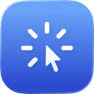
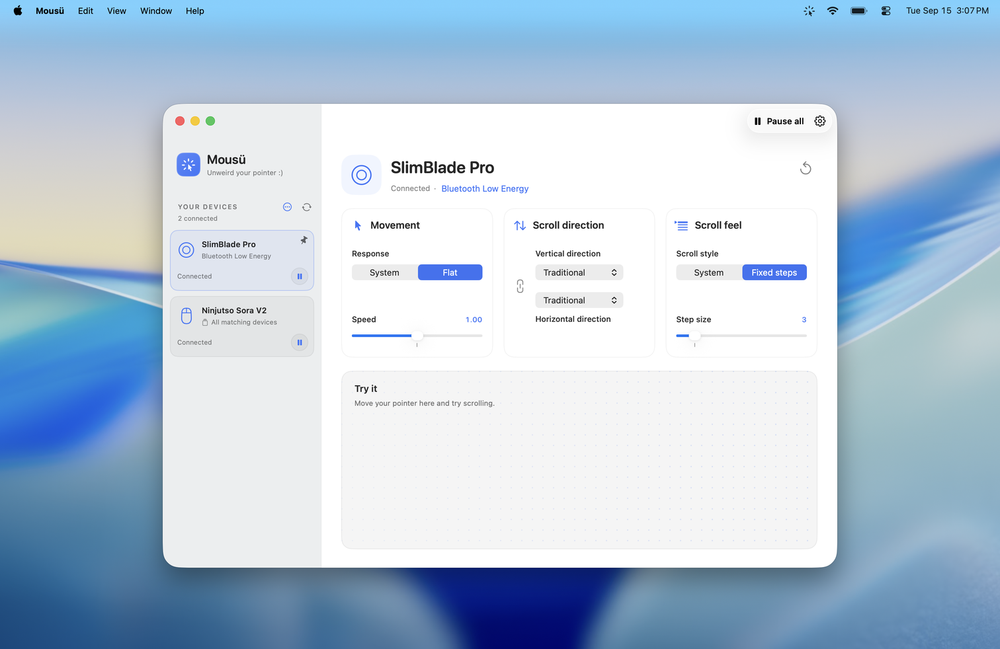

# Mousü

Per-device pointer and scrolling controls for external mice, trackballs, and trackpads. Native SwiftUI/AppKit app with an optional menu bar panel. The built-in trackpad keeps its macOS settings.

**0.9.1 beta · macOS 26 or later · Apple Silicon**

<picture>
  <source media="(prefers-color-scheme: dark)" srcset="website/assets/mousu-dark-1512.webp">
  <source media="(prefers-color-scheme: light)" srcset="website/assets/mousu-light-1512.webp">
  
</picture>

- System or flat pointer response, with adjustable speed where supported.
- Independent vertical and horizontal scroll direction.
- Fixed steps for mouse wheels; continuous scrolling and momentum for touch devices.
- Saved device settings, shared matching-device cards, and individual or global pause.
- Optional automatic device setup and launch at login.

Device support depends on the identity and capabilities macOS exposes. Unknown or unsupported input passes through unchanged.

## Install

[Download Mousü 0.9.1 beta](https://github.com/kiprasdak/Mousu/releases/download/v0.9.1-beta.1/Mousu.dmg) and open the disk image. Drag **Mousü** to **Applications**, eject the image, then open Mousü from Applications.

This beta is ad-hoc signed and **not notarized**. If macOS blocks it, first attempt to open it, then go to **System Settings → Privacy & Security → Open Anyway**. See [Apple's instructions](https://support.apple.com/en-gb/102445). Grant **Accessibility** when Mousü asks and finish setup.

To update, quit Mousü, replace the app in Applications, and reopen it. Saved settings remain in place; a new ad-hoc build may require renewing Accessibility permission. Do not delete the support folder when updating.

The release includes `SHA256SUMS` for verifying the downloaded DMG.

## Build

Install [mise](https://mise.jdx.dev/), full Xcode, and Command Line Tools with the **macOS 26.5 SDK**. The scripts require **Swift 6.3.3** and `/Library/Developer/CommandLineTools/SDKs/MacOSX26.5.sdk`; they do not fall back to another compiler or SDK.

From the repository root:

```sh
mise trust
mise install
./scripts/doctor
./scripts/bundle release
open dist/Mousü.app
```

Bundling uses Xcode at `/Applications/Xcode.app`; set `MOUSU_XCODE_DEVELOPER_DIR` if it is installed elsewhere. If the Metal compiler is missing, install its component and retry:

```sh
DEVELOPER_DIR=/Applications/Xcode.app/Contents/Developer xcodebuild -downloadComponent MetalToolchain
```

A `libSwiftScan` fallback warning is harmless when the build succeeds. `./scripts/build` builds a debug executable; `./scripts/bundle debug` creates a debug app bundle. `./scripts/check` checks formatting and whitespace.

To build the drag-to-Applications disk image, run `./scripts/dmg`. This also builds the release app and writes `dist/Mousu.dmg`, `dist/SHA256SUMS`, and a layout preview. Packaging requires Python 3.10+ (`MOUSU_PYTHON` can select it); the script installs pinned build tools into an isolated `.build/` environment on first use.

Quit Mousü before rebuilding. The bundle is ad-hoc signed and **not notarized**. Keep it in a stable location; replacing the binary may require renewing its Accessibility permission.

## Use

Grant **System Settings → Privacy & Security → Accessibility**, then finish first-time setup. Later permission restoration resumes control automatically. No Input Monitoring permission, driver, or privileged helper is required.

Automatic setup is enabled by default: flat pointer response at 1×, traditional scroll direction, and three lines per wheel step where supported. Disable it during setup or in Settings to leave new devices at system defaults. Existing saved settings are preserved.

Devices with a unique identifier retain their settings across reconnects. For devices without one, choose **Use for all matching devices**. An existing shared card can also recognize unambiguous connections with the same reported model name, vendor, and pointer function. Renaming a card or overriding its connection label does not change hardware identity.

**Open at login** starts Mousü in the background without opening a window or showing a Dock icon. **Open Mousü** in the menu bar brings the window to that display and the current Space.

Closing the window leaves Mousü running. **Pause all** or **Quit Mousü** restores the system properties it still owns. After a force quit, reopen Mousü to recover changes; reconnect the device if needed.

If Accessibility is enabled but Mousü still reports it missing after a rebuild, remove the old entry, add the current app again, and restart it.

## Local data and removal

Settings and the recovery journal are stored in `~/Library/Application Support/Mousu/`. Window and appearance preferences use the `com.kiprasdak.Mousu` preferences domain. No input history is stored.

To uninstall, disable **Open at login**, quit Mousü, then delete the app and remove its Accessibility entry. To also erase saved settings, delete the support folder after recovery has completed and run:

```sh
defaults delete com.kiprasdak.Mousu
```

## Source

`Sources/` contains the Swift core, native HID bridge, and app. `Resources/` contains the icons and offline device metadata. `website/` contains the static landing page.

The app has no third-party package dependencies. Bundled device data has separate licenses; see [third-party notices](THIRD_PARTY_NOTICES.md).

Copyright © 2026 kiprasdak. Original source: [MIT License](LICENSE). Third-party artwork and data retain their own terms.
